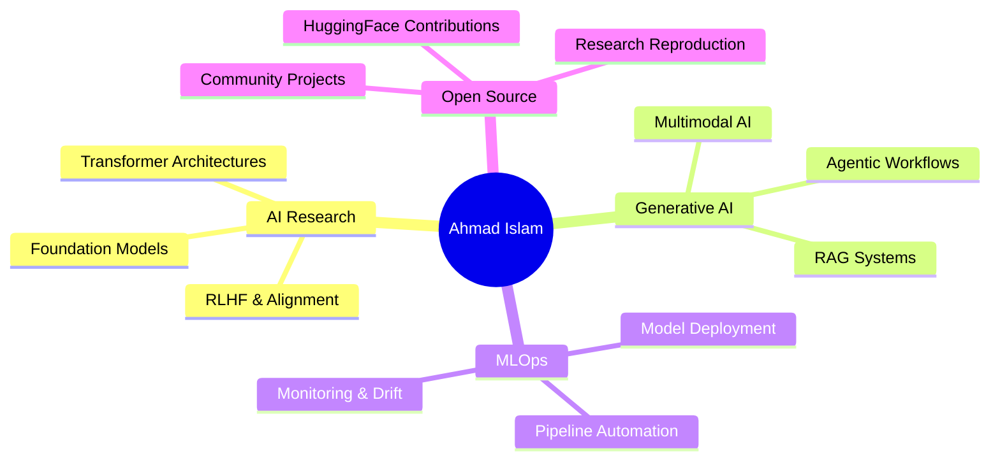

<!-- ╔══════════════════════════════════════════════════════════════╗ -->
<!-- ║          AHMAD ISLAM — GITHUB PROFILE README                 ║ -->
<!-- ╚══════════════════════════════════════════════════════════════╝ -->

<!-- ░░░░░░░░░░░░░░░░░  HERO HEADER  ░░░░░░░░░░░░░░░░░░░░░░░░░░░░░ -->
<div align="center">


</div>

<!-- ░░░░░░░░░░░░░░░░░  MATRIX TYPING  ░░░░░░░░░░░░░░░░░░░░░░░░░░░ -->
<div align="center">
<a href="https://git.io/typing-svg">
  
</a>

<br/>

<!-- STATUS BADGES -->

&nbsp;

&nbsp;

&nbsp;


</div>

<br/>

<!-- ░░░░░░░░░░░░░░░░░  ANIMATED DIVIDER  ░░░░░░░░░░░░░░░░░░░░░░░░ -->


<!-- ░░░░░░░░░░░░░░░░░  ABOUT ME  ░░░░░░░░░░░░░░░░░░░░░░░░░░░░░░░░ -->
<table width="100%">
<tr>
<td width="55%" valign="top">

## 🧬 &nbsp;`whoami`

```python
#!/usr/bin/env python3
# ━━━━━━━━━━━━━━━━━━━━━━━━━━━━━━━━━━━━━━━━━━━

class AhmadIslam:
    """
    AI/ML Engineer | Builder | Researcher
    ─────────────────────────────────────
    """
    name       = "Ahmad Islam"
    role       = "AI / ML Engineer 🤖"
    location   = "Rawalpindi, Pakistan 🇵🇰"
    
    languages  = ["Python 🐍", "C++ ⚙️", "JavaScript 🌐"]
    
    ml_stack   = {
        "frameworks"  : ["TensorFlow", "PyTorch", "Keras"],
        "nlp"         : ["HuggingFace", "LangChain", "OpenAI"],
        "data"        : ["NumPy", "Pandas", "Scikit-Learn"],
        "vision"      : ["OpenCV", "YOLO", "Detectron2"],
        "deployment"  : ["Docker", "FastAPI", "MLflow"],
    }
    
    currently  = "🔬 Exploring Agentic AI & RAG Systems"
    seeking    = "🤝 Open Source & Research Collabs"
    contact    = "📧 ahmadislam2211@gmail.com"
    
    def philosophy(self) -> str:
        return (
            "The best model is the one "
            "that ships to production 🚀"
        )

me = AhmadIslam()
print(me.philosophy())

# Output:
# The best model is the one that ships to production 🚀
```

</td>
<td width="45%" valign="top" align="center">

<br/><br/>


<br/>


</td>
</tr>
</table>

<!-- QUICK FACTS -->
<div align="center">

| 🔭 Working On | 🌱 Mastering | 💬 Ask Me About | ⚡ Fun Fact |
|:---:|:---:|:---:|:---:|
| Deep Learning & GenAI | LLMs, RAG & Agentic AI | Neural Networks & MLOps | My models sometimes outsmart me 😂 |

</div>

<br/>

<!-- ░░░░░░░░░░░░░░░░░  ANIMATED DIVIDER  ░░░░░░░░░░░░░░░░░░░░░░░░ -->


<!-- ░░░░░░░░░░░░░░░░░  TROPHIES  ░░░░░░░░░░░░░░░░░░░░░░░░░░░░░░░░ -->
## 🏆 &nbsp;GitHub Trophies

<div align="center">


</div>

<br/>

<!-- ░░░░░░░░░░░░░░░░░  ANIMATED DIVIDER  ░░░░░░░░░░░░░░░░░░░░░░░░ -->


<!-- ░░░░░░░░░░░░░░░░░  TECH ARSENAL  ░░░░░░░░░░░░░░░░░░░░░░░░░░░░ -->
## 🛠️ &nbsp;Tech Arsenal

<div align="center">

<!-- ROW 1: AI/ML CORE -->
<h3>🤖 &nbsp;AI · ML · Deep Learning Core</h3>


&nbsp;&nbsp;


<br/><br/>

<!-- ROW 2: LLMs & GENAI -->
<h3>🔮 &nbsp;LLMs · Generative AI · Agentic Systems</h3>


<br/><br/>

<!-- ROW 3: DATA SCIENCE -->
<h3>📊 &nbsp;Data Science · Analysis · Visualization</h3>


<br/><br/>

<!-- ROW 4: DATABASES & VECTOR STORES -->
<h3>🗄️ &nbsp;Databases · Vector Stores · MLOps</h3>


<br/><br/>

<!-- ROW 5: DEVOPS & CLOUD -->
<h3>☁️ &nbsp;DevOps · Cloud · Infrastructure</h3>


<br/><br/>

<!-- ROW 6: WEB STACK -->
<h3>🌐 &nbsp;Web Stack</h3>


</div>

<br/>

<!-- ░░░░░░░░░░░░░░░░░  ANIMATED DIVIDER  ░░░░░░░░░░░░░░░░░░░░░░░░ -->


<!-- ░░░░░░░░░░░░░░░░░  EXPERTISE RADAR  ░░░░░░░░░░░░░░░░░░░░░░░░░ -->
## 🧠 &nbsp;Expertise Radar

<div align="center">

```
 ╔══════════════════════════════════════════════════════════════════════╗
 ║                    ⚡  SKILL MATRIX  ⚡                              ║
 ╠══════════════════════════════════════════════════════════════════════╣
 ║                                                                      ║
 ║  🤖  Machine Learning       ████████████████████░░░   88%  Expert   ║
 ║  📊  Data Science           ███████████████████░░░░   82%  Expert   ║
 ║  🧬  Deep Learning          ████████████████░░░░░░░   80%  Adv.     ║
 ║  🔮  Generative AI & RAG    ████████████████░░░░░░░   78%  Adv.     ║
 ║  🗣️  NLP & Large LLMs       ██████████████░░░░░░░░░   75%  Adv.     ║
 ║  🦾  Agentic AI Systems     █████████████░░░░░░░░░░   72%  Adv.     ║
 ║  👁️  Computer Vision        ██████████████░░░░░░░░░   65%  Inter.   ║
 ║  ⚙️  MLOps & Deployment      ████████████░░░░░░░░░░░   60%  Inter.   ║
 ║  🌐  Full-Stack (Bonus)      ██████████░░░░░░░░░░░░░   55%  Inter.   ║
 ║                                                                      ║
 ╠══════════════════════════════════════════════════════════════════════╣
 ║  🏅 Novice  ██░░  🥈 Intermediate  ████░░  🥇 Advanced  ██████░░    ║
 ║  🏆 Expert  ████████░░░░░░░░░░░░░░░░░░░░░░░░░░░░░░░░░░░░░░░░░░░░   ║
 ╚══════════════════════════════════════════════════════════════════════╝
```

</div>

<br/>

<!-- ░░░░░░░░░░░░░░░░░  ANIMATED DIVIDER  ░░░░░░░░░░░░░░░░░░░░░░░░ -->


<!-- ░░░░░░░░░░░░░░░░░  GITHUB STATS  ░░░░░░░░░░░░░░░░░░░░░░░░░░░░ -->
## 📊 &nbsp;GitHub Stats

<div align="center">


<br/>


&nbsp;&nbsp;


</div>

<br/>

<!-- ░░░░░░░░░░░░░░░░░  ANIMATED DIVIDER  ░░░░░░░░░░░░░░░░░░░░░░░░ -->


<!-- ░░░░░░░░░░░░░░░░░  CONTRIBUTION GRAPH  ░░░░░░░░░░░░░░░░░░░░░░ -->
## 📈 &nbsp;Contribution Activity

<div align="center">


</div>

<br/>

<!-- ░░░░░░░░░░░░░░░░░  PROFILE SUMMARY CARDS  ░░░░░░░░░░░░░░░░░░░ -->
## 📋 &nbsp;Profile Summary

<div align="center">


</div>

<br/>

<!-- ░░░░░░░░░░░░░░░░░  ANIMATED DIVIDER  ░░░░░░░░░░░░░░░░░░░░░░░░ -->


<!-- ░░░░░░░░░░░░░░░░░  CURRENT FOCUS  ░░░░░░░░░░░░░░░░░░░░░░░░░░░ -->
## 🎯 &nbsp;Current Focus & Learning Path

<div align="center">



</div>

<br/>

<!-- ░░░░░░░░░░░░░░░░░  ANIMATED DIVIDER  ░░░░░░░░░░░░░░░░░░░░░░░░ -->


<!-- ░░░░░░░░░░░░░░░░░  CONTRIBUTION CALENDAR  ░░░░░░░░░░░░░░░░░░░░░░ -->
## 📅 &nbsp;Contribution Calendar

<div align="center">

<!-- ghchart — always live, no token needed -->


<br/><br/>


</div>

<br/>

<!-- ░░░░░░░░░░░░░░░░░  ANIMATED DIVIDER  ░░░░░░░░░░░░░░░░░░░░░░░░ -->


<!-- ░░░░░░░░░░░░░░░░░  AI SHOWCASE  ░░░░░░░░░░░░░░░░░░░░░░░░░░░░░░ -->
## ✨ &nbsp;AI Engineer at a Glance

<div align="center">

<!-- Capsule render banner — 100% reliable -->


<br/><br/>

<!-- Skill counters as animated typing lines -->


<br/>

<!-- Skill badges in a clean row -->


<br/><br/>

<!-- Wave capsule for visual break -->


</div>

<br/>

<!-- ░░░░░░░░░░░░░░░░░  ANIMATED DIVIDER  ░░░░░░░░░░░░░░░░░░░░░░░░ -->


<!-- ░░░░░░░░░░░░░░░░░  QUOTE  ░░░░░░░░░░░░░░░░░░░░░░░░░░░░░░░░░░░ -->
## 💬 &nbsp;Dev Quote of the Day

<div align="center">


</div>

<br/>

<!-- ░░░░░░░░░░░░░░░░░  ANIMATED DIVIDER  ░░░░░░░░░░░░░░░░░░░░░░░░ -->


<!-- ░░░░░░░░░░░░░░░░░  CONNECT  ░░░░░░░░░░░░░░░░░░░░░░░░░░░░░░░░░ -->
## 🤝 &nbsp;Let's Connect & Collaborate

<div align="center">

<a href="https://www.linkedin.com/in/ahmadislam" target="_blank">
  
</a>&nbsp;
<a href="https://github.com/ahmadislam786" target="_blank">
  
</a>&nbsp;
<a href="mailto:ahmadislam2211@gmail.com">
  
</a>&nbsp;
<a href="https://kaggle.com/ahmadislam" target="_blank">
  
</a>&nbsp;
<a href="https://huggingface.co/ahmadislam" target="_blank">
  
</a>

<br/><br/>

<!-- SUPPORT -->
<a href="https://buymeacoffee.com/ahmadislam" target="_blank">
  
</a>

<br/><br/>

<!-- CLOSING QUOTE -->


</div>

<br/>

<!-- ░░░░░░░░░░░░░░░░░  FOOTER  ░░░░░░░░░░░░░░░░░░░░░░░░░░░░░░░░░░ -->


<!-- ─────────────────────────────────────────────────────────────── -->
<!-- Built with 🤖 + ❤️ by Ahmad Islam  |  Rawalpindi, Pakistan     -->
<!-- ─────────────────────────────────────────────────────────────── -->
